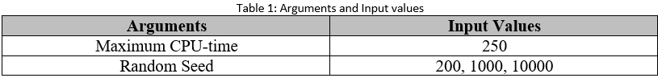

# statistics-experiment-analysis

**Definition of Problem and Necessary Comments to Design Expriments**

The purpose of the assignment is to design the experiment and execute all the steps to
evaluate the following general problem statement:
There are several exams to be scheduled at the Department of Informatics Engineering
and there is a number of free time slots. You have done a program that automatically
schedules exams, that is, it assigns an exam to a time slot such that every student does
not have to attend more than one exam simultaneously and it uses the least number of
time slots available. Assume that the time slots do not overlap in time.
Given the success of your program, you are now planning to sell it to other universities.
An important aspect to potential clients is to know how much time they need to wait to
obtain a schedule with the minimum number of time slots. This should depend on the
number of exams, the number of time slots available, and the number of students that
have exams. Your goal is to characterize the performance of your program for several
scenarios.
Although this is a somewhat artificial problem statement (the main goal is pedagogic
and not to represent a realistic research question), it is worth noting that it requires all
the steps of a real experiment. Furthermore, the type of measurements required by this
experiment (performance) is highly representative of experiments with computers.
The following assumptions and recommendations should be taken into account in the
work:

A-There are two programs (code1.c and code2.c) that implement two randomized
backtracking algorithms to solve the exam scheduling problem, which are
available at UCstudent. You can decide to use these two implementations or to
use others that are publicly available (the source must be referenced in the
assignment report), or even to implement your own. (compiled files of code1.c and code2.c are available in the following address:
https://drive.google.com/file/d/12h4Eb1hpeOR1w0STZM7_NIFZiPGXoS5Q/view?usp=sharing
https://drive.google.com/file/d/1n-1sJPs4wFzn3PesWuoVQzgeB-YEQ-aD/view?usp=sharing
)

B-Both implementations require three arguments: a random seed, the maximum
CPU-time in seconds to run the program and the name of the file that contains
the input data. Both output the following information for each input data: the
minimum number of time slots that is possible to use, or value -1 in case the
minimum number of times slots is not found within the maximum time defined
by the user. Since some experiments may take too much time, define the
maximum CPU-time at your choice.

C-The file code1.c implements a backtracking algorithm that will try to find a
schedule with n time slots. If it finds one, it will try to find a schedule with n-1
time slots, and so on, until it does not find a feasible schedule for some number i
of time slots. In that case, the backtracking algorithm terminates and outputs
value i+1. The file code2.c implements a similar search strategy, but it will first
try a schedule with one time slot, and if it does not exist, it will try with two, and
so on, until it finds a schedule with j times slots. In that case, it terminates and
outputs value j.

D-There is an input data generator in python (gen.py) that is also available at
UCstudent. This generator creates randomly generated input data that can be
read by the two implementations mentioned above. You need to define the
number of exams, the probability (p) that each pair of exams will have a student
in common, the random seed, and the name of the file that will store the input
data. Each file that is generated contains two integers (n and m) in the first row,
and each of the next m lines contains two integers, the indices of two exams for
which there exists at least a student in common. The exams are numbered from 1
to n. You may consider other generators with different features.

E-You should also set up the number of times the implementation is ran in order to
obtain adequate measurements. In case of outliers, you have to decide whether
they are relevant or not for the analysis.

F-Note that if the number of exams is too small, you may have difficulties in
measuring the time accurately, but if the numbers are too large you may have
other problems such as the time taken by the experiments or the programs may
reach some limits of the machine (e.g., memory) that may complicate the
experiments. The implementations can deal with at most 299 exams, but you can
define a larger value.

G-The experiments can be repeated using slightly different conditions in order to
understand better the situation and allow the generalization of the results. It is
open to you to explore this possibility.

**Introduction**

Every student is not required to attend more than one exam at a time, and the DEI has multiple exams planned with multiple free time slots for assignment. To determine how long it will take to obtain a schedule, two programs have been created. This need to be contingent upon the quantity of examinations, the quantity of time slots, and the quantity of students taking exams. In order to analyze the impacts of changing the exam number and probability input parameters on the time slot and processing time, as well as to compare and contrast the two systems' performances under various circumstances, these parameters will be changed.

**Methodology**

To tackle the exam scheduling problem, we employed two programs, Code1 and Code2, both based on C and implementing two randomized backtracking methods. Additionally, there are two arguments for which input needs to be given; Table 1 lists them. To have a good coverage of potential inputs, we have employed a variety of seeds. It is important to note that Python was used to create every graph in this report.
For each of these programs, we ran each scenario independently so that we could compare the performance of code1 and code2 in addition to looking at the data and data relationships. If the minimal number of time slots cannot be discovered within the specified maximum time, the minimum number of time slots is -1.
It is important to note that we neglected to look into this from an experimental standpoint because the relationship between probability and the minimal number of time slots is rather clear—as likelihood rises, the problem needs more time slots to be addressed.

**Arguments and Input values**

**Independent and Dependent variables**

**Data Set**

We made use of a Python-written random input data generator. We specified the number of tests, the random seed, the name of the file containing the input data, and the likelihood that any two tests will have a student in common. The number of exams and the number of exam pairs having at least one student in common are shown in the first row's first and second columns, respectively. The pair exams with at least one shared student are in the remaining rows. Table 3 lists the values of the independent variables that were employed in this project.

**Step 1:**

Follwing above mentioned structure, gen.py should be run with different numbers for:

E: number of exams: 10, 20, 30, 40, 50

P: the probability that each pair of exams will have a student in common: 20, 40, 60, 80, 100

S: number regarding random seed: 200,1000,50000

F: file name will be saved by file suffix "*.in"

The orgiinal gen.py file is available in the following link; however, it i necessary to add some loops to deploy my expriments (scenarios) to achieve several "*.in" automativally. https://drive.google.com/file/d/19VA52sBh7h7dogTj1Msa8y8ITkTKk23L/view?usp=sharing

As it is clear in body of code my experience is combination of changing arguments in nested for loops.

Output of this programs are 75 = 5(counts of exams) * 5(counts of propabilities) * 3(counts of seeds) files.

**Step 2:**

I should feed up code1.exe and code2.exe by 285 files which are generated in previous codes. Absolutely feeding up the application files in a string in command prompt and collecting the rsults one by one for 285 file is not only a time consumuing task but also high potential to have errors.

Accordingly, it is necessary to develop code to feed up the application and collect results from command prompt.

For example I should run the following string in cmd:

command: code1 1000(seed) 100(CPU time limit) 21E50P20S1000.in (pregenerated file name)

or

C:\code1 31235 250 E50P20S1000.in

I above mentiones line, 31235 is random nimber for running code1/code2, 250 is the maximum time for running the code otherwise the CPU time output will be reported -1, E50P20S1000 is the name of "*.in" files to feed code1/code2

In order to be able to output data analysis and visualization, I decided to put results which are categorized by probabilties in csv files.

**Exploratory Data Analysis**

**Scatter Plot:**

A scatter plot can be used to examine the relationship between two numerical variables. The performance of both codes in the event of time processing at various probabilities is displayed in the following graphs. To examine the link between the variables, I compute the average of three distinct measurements for each type of seed. Every seed has a distinct point color displayed. Based on the results, we have not taken into account a fixed y axis for better understanding, and it is scalable.

**Histogram:**

A variable's set of values' distribution is displayed using a histogram. The distribution of time slots and processing times for various bin sizes based on Codes 1 and 2 are displayed in the following graphs. The number of bins and the size of the bins are inversely correlated. There will be fewer bins to cover the whole data range the larger the bin size. It's worthwhile to take some time to experiment with various bin sizes to see how the distribution appears in each, and then select the chart that best displays the data [2]. We utilized a range of bin sizes, from 2 to 10, because of this.
Because of the lower bound, which is -1 and indicates that the time processing is greater than 250, all of them in Figure 8 are skewed to the right.
Figures 10 and 11 make it easy to see that the distributions of both codes are symmetric, bimodal histograms. Additionally, the majority of distributions fall between 0 and 250, meaning that these comprise the majority of Time Processing outputs.

**Polynomial Regression**

As seen in Figures 12 and 13, we employed polynomial regression for the regression, and the outcomes for the two codes are comparable. better degrees are associated with better R2 and lower MSE. Based on our data, we may conclude that our degree 2 regression is more accurate, particularly for smaller exam numbers (10 and 20). Our curve has distorted when there are 40 exams, leading to a repeat of 250, which is the maximum processing time. Degrees more than 2 are disregarded due to their unreliability and overfitting.
The regression results for the two codes for time slots are similar to one another, as shown in Figure 14. With the exception of the scenario involving the ten tests, the relationship between the two variables in both codes is negative. The program released an outlier, or -1, more frequently than expected. As a result, by raising the likelihood of the number of time slots, the outlier was reduced.

